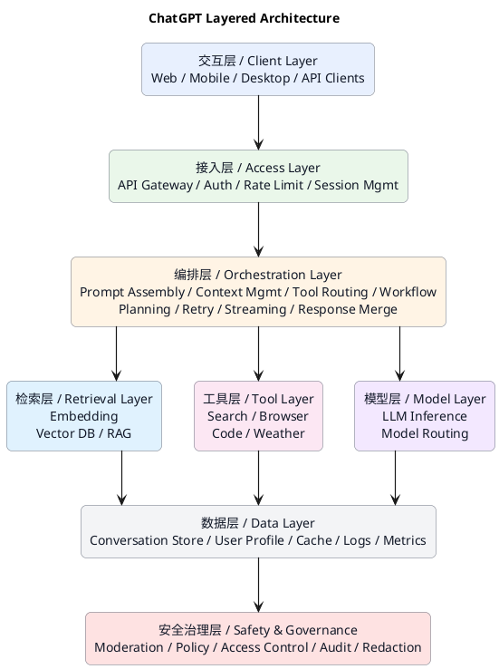
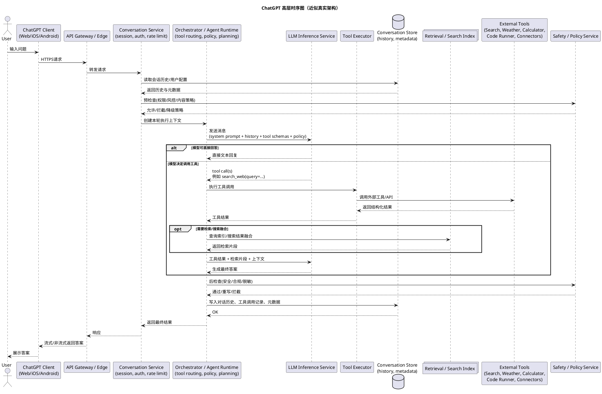
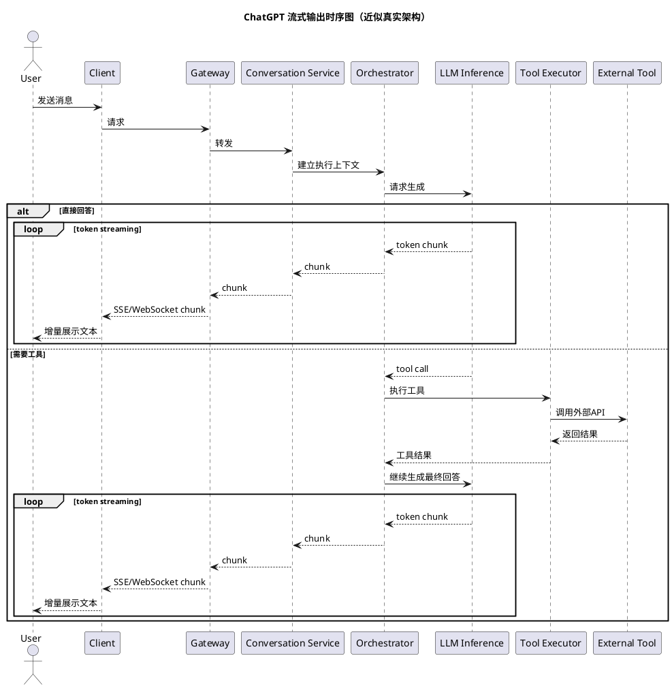

# 大模型工具调用原理

## 1.以ChatGPT为例

### 调用流程

### 客户端层
就是你看到的 ChatGPT 产品形态：
- Web
- 手机 App
- 桌面端

它们只负责：
- 收集用户输入
- 展示模型输出
- 处理流式显示、附件上传、按钮交互等

---

### 平台/边缘层
这一层通常包括：
- API Gateway
- 鉴权
- 限流
- 风控
- 会话服务

作用是把“用户请求”变成“一个可执行的 AI 任务”。

---

### Orchestrator / Agent Runtime
这层是关键中的关键。  
如果说 LLM 是大脑，这层就是**调度中枢**。

负责：
- 拼装 prompt
- 决定给模型哪些工具可用
- 接收模型返回的 tool call
- 调用工具执行
- 把工具结果再次送回模型
- 控制多轮调用次数
- 处理失败重试
- 记录日志与轨迹

这也是为什么说，**真正的 ChatGPT 不只是一个模型，而是一个“模型 + 调度系统 + 工具系统 + 安全系统”的整体产品。**

---

### 模型层
这里不只是一个模型实例，通常还会有：
- 模型路由（不同任务走不同模型）
- 推理服务
- embedding 服务（做检索）

例如：
- 简单问答走快速模型
- 复杂推理走更强模型
- 检索时调用 embedding 模型

---

### 数据与知识层
包括：
- 对话历史
- 用户偏好
- 检索索引
- 日志审计

模型本身不是“数据库”，真正的产品必须把这些数据放在外部系统里。

---

### 工具层
包括：
- 搜索
- 浏览器
- 代码执行沙箱
- 计算器
- 天气
- 企业连接器

模型只能“决定调用”，真正执行在工具层。

---

### 安全治理层
真实产品一定会有这层，不然风险非常大。

例如：
- 敏感内容审核
- PII 脱敏
- 权限检查
- 工具访问控制
- 输出合规检查

---
