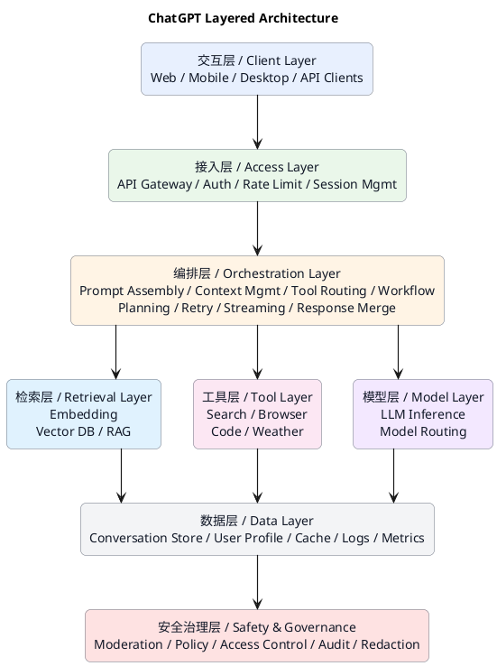
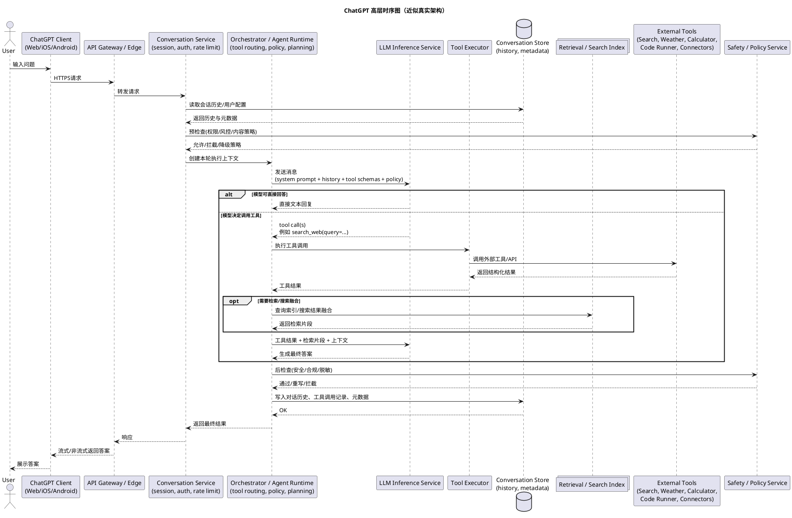
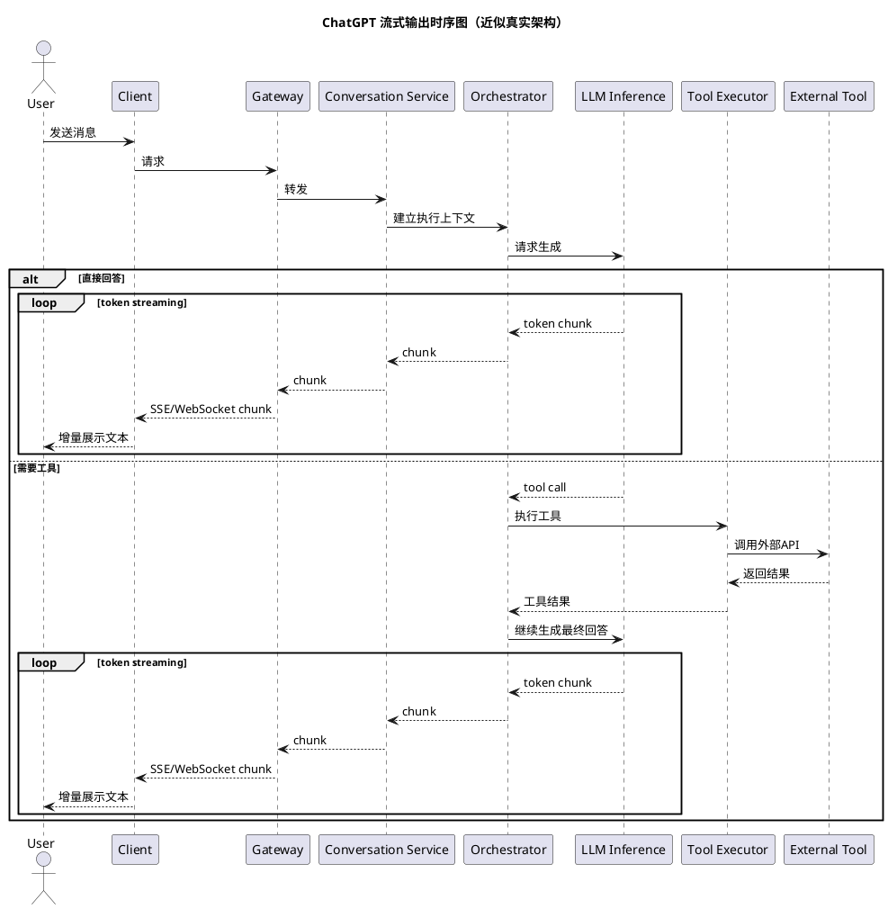
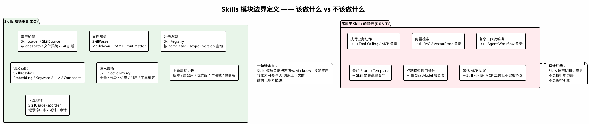
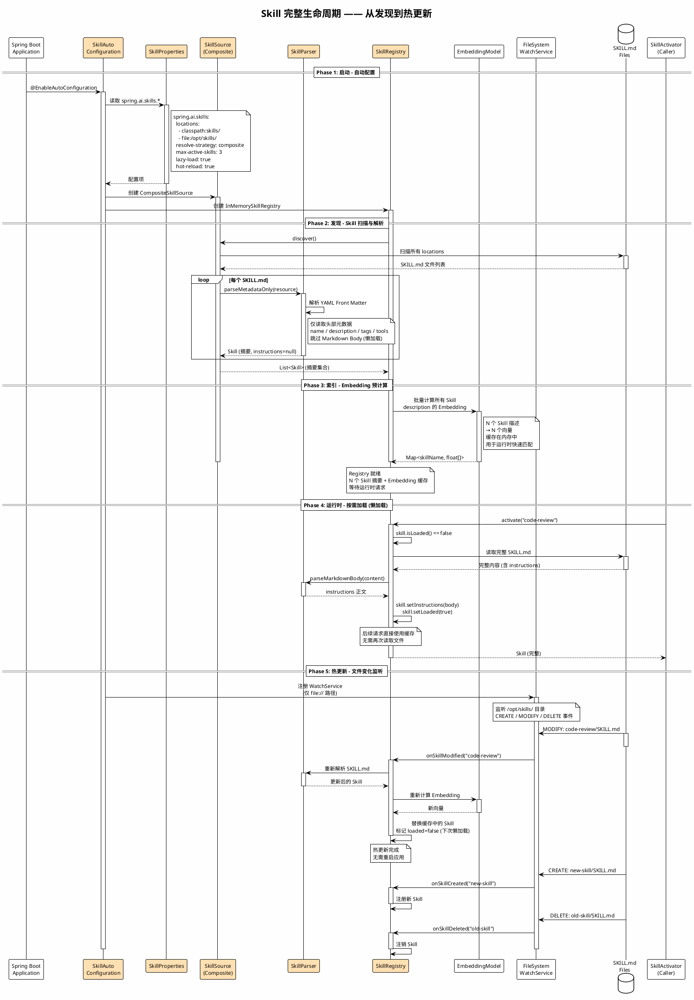
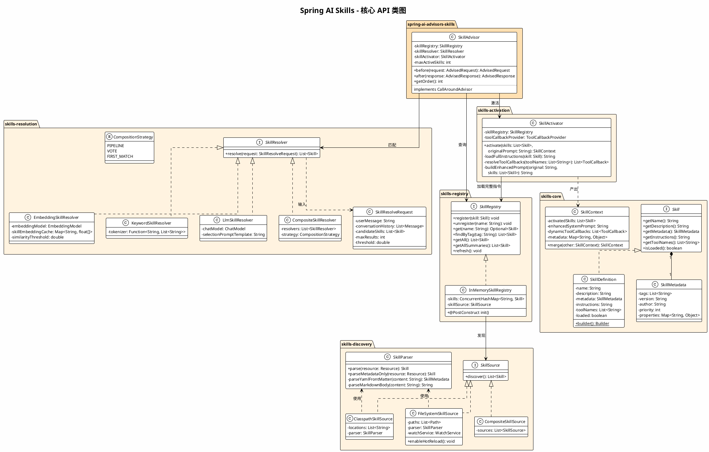
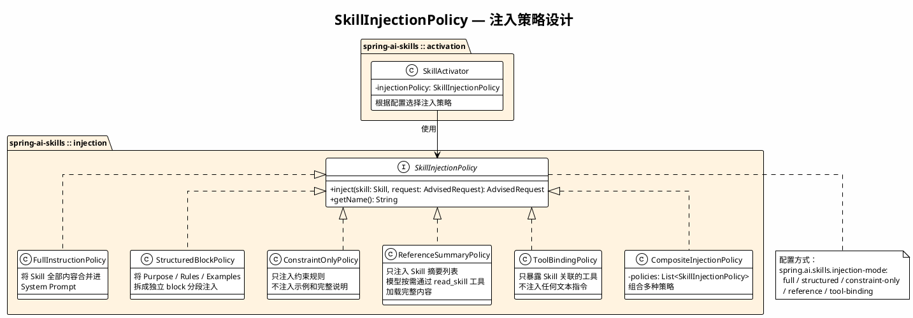

# 大模型工具调用原理

在 Agentic AI 的开发实践中，大模型的能力扩展依赖三种核心机制。RAG（检索增强生成）解决的是"如何获取外部知识"，Tool Calling / Function Calling 解决的是"如何执行外部操作"，而 Skills（声明式技能）解决的是更高层的问题——如何将一组 Prompt 指令、Tool 绑定和可选的 RAG 配置打包为一个可复用的能力单元，并在运行时按需加载。

Skills 的核心价值是"渐进式上下文披露"（Progressive Disclosure）：不在对话开始时就把所有工具描述和指令塞进 Prompt，而是根据用户意图语义匹配最相关的 Skill，按需加载完整指令和关联工具。这样既节省 token 消耗，又让 Agent 能管理大量技能而不会因为上下文过长而降低效果。

## 1.以ChatGPT为例

### 1.1.调用流程

### 1.2.客户端层
就是你看到的 ChatGPT 产品形态：
- Web
- 手机 App
- 桌面端

它们只负责：
- 收集用户输入
- 展示模型输出
- 处理流式显示、附件上传、按钮交互等

---

### 1.3.平台/边缘层
这一层通常包括：
- API Gateway
- 鉴权
- 限流
- 风控
- 会话服务

作用是把“用户请求”变成“一个可执行的 AI 任务”。

---

### 1.4.Orchestrator / Agent Runtime
这层是关键中的关键。  
如果说 LLM 是大脑，这层就是**调度中枢**。

负责：
- 拼装 prompt
- 决定给模型哪些工具可用
- 接收模型返回的 tool call
- 调用工具执行
- 把工具结果再次送回模型
- 控制多轮调用次数
- 处理失败重试
- 记录日志与轨迹

这也是为什么说，**真正的 ChatGPT 不只是一个模型，而是一个“模型 + 调度系统 + 工具系统 + 安全系统”的整体产品。**

---

### 1.5.模型层
这里不只是一个模型实例，通常还会有：
- 模型路由（不同任务走不同模型）
- 推理服务
- embedding 服务（做检索）

例如：
- 简单问答走快速模型
- 复杂推理走更强模型
- 检索时调用 embedding 模型

---

### 1.6.数据与知识层
包括：
- 对话历史
- 用户偏好
- 检索索引
- 日志审计

模型本身不是“数据库”，真正的产品必须把这些数据放在外部系统里。

---

### 1.7.工具层
包括：
- 搜索
- 浏览器
- 代码执行沙箱
- 计算器
- 天气
- 企业连接器

模型只能“决定调用”，真正执行在工具层。

---

### 1.8.安全治理层
真实产品一定会有这层，不然风险非常大。

例如：
- 敏感内容审核
- PII 脱敏
- 权限检查
- 工具访问控制
- 输出合规检查

---

## 2 Spring AI 对SKILLS的支持

Spring AI 1.0 GA（2025 年 5 月发布）内置了两类核心扩展机制。Tool Calling 通过 `@Tool` 注解声明工具方法，在对话时由模型自主决策是否调用，框架屏蔽 OpenAI、Anthropic、Google 等不同提供商的协议差异。MCP 协议集成遵循 Model Context Protocol 标准，连接外部服务和数据源。

然而，Spring AI 官方核心目前没有内置声明式 Skills 管理模块——没有 SKILL.md 文件解析、没有技能注册中心、没有按需激活机制。

### 2.1 Spring AI Alibaba 的 Agent Skills 框架

阿里巴巴的社区扩展项目 Spring AI Alibaba 在 1.1.2.0 版本中引入了 Agent Skills 框架。其核心设计：每个 Skill 是一个目录，包含一个 SKILL.md 文件，采用 YAML Front Matter + Markdown Body 的结构。启动时框架只解析元数据摘要，运行时通过内置的 `read_skill` 工具按需加载完整指令。这种格式源自微软提出的 Agent Skills 开放规范。

| 维度 | Tool Calling | MCP | Skills |
|------|-------------|-----|--------|
| 抽象层次 | 基础设施原语 | 跨平台协议 | 应用层模式 |
| 加载方式 | 启动时全量注入 | 运行时按协议发现 | 运行时按需匹配加载 |
| 定义方式 | `@Tool` 注解 / 代码 | JSON-RPC 协议 | SKILL.md 声明文件 |
| 上下文占用 | 所有工具描述常驻 Prompt | 按协议动态获取 | 仅匹配命中的 Skill 注入 |
| Spring AI 支持 | 官方核心内置 | 官方核心内置 | 仅 Spring AI Alibaba 扩展 |

### 2.2.为什么Spring AI没有Skills

这不是疏忽，而是一个有意的架构决策，背后有三层原因。

**抽象层次不同。** RAG 涉及一整套底层技术组件（Embedding Model、Vector Store、文档解析与分块、检索策略），不同向量数据库的 API 差异巨大，框架必须提供统一抽象。Tool Calling 需要屏蔽各模型提供商的 function calling 协议差异。这两者本质上是"基础设施适配"问题——如果框架不做，开发者很难自己做好。而 Skills 不引入任何新的底层技术组件，它的每个组成部分（Prompt 模板、Tool 注册、动态上下文管理）都已经被 Spring AI 现有原语（ChatClient、@Tool、Advisor）覆盖。换句话说，Skills 如果框架不做，开发者用现有积木就能搭出来。

**Spring 的设计哲学。** Spring 一贯提供正交的、可组合的基础构建块，而不是过早地固化上层应用模式。正如 Spring Framework 提供了 IoC 和 AOP 原语，但并没有内置 CQRS 或 Saga 模式。Skills 作为一种 Agent 组织模式，同样属于应用层选择。

**规范成熟度。** 微软提出的 Agent Skills 开放格式还在早期阶段，社区对"Skill 应该长什么样"尚无共识。Spring 团队倾向于等标准成熟后再纳入核心。

### 2.3 如何设计和实现SpringAI-Skills

#### 模块边界

在进入具体设计之前，首先必须明确 Skills 模块"该做什么"和"不该做什么"。这是整个设计最关键的决策——边界一旦模糊，模块就会膨胀为一个"万能 Agent 平台"，与 Tool Calling、RAG、Workflow 产生不必要的职责重叠。

Skills 模块的一句话定义：**负责把声明式 Markdown 技能资产转化为可参与 AI 调用上下文的结构化能力描述。**

它负责七件事：资产加载、文档解析、注册发现、语义匹配、注入策略、生命周期治理、可观测性。它不负责六件事：执行业务动作（由 Tool Calling / MCP 负责）、向量检索（由 RAG / VectorStore 负责）、复杂工作流编排（由 Agent Workflow 负责）、替代 PromptTemplate、控制模型调用参数、替代 MCP 协议。

#### 模块生命周期

从应用启动（自动配置、扫描解析、Embedding 预计算）到运行时按需懒加载，再到文件变化触发热更新的完整生命周期：

#### 核心模块

spring-ai-skills 内部分为六个子包，每个子包职责单一、边界清晰。

**core 包**定义数据模型。`Skill` 是顶层接口，`SkillDefinition` 是标准实现，`SkillMetadata` 承载 tags、version、author、priority、scope 等元信息，`SkillResource` 表示原始文件资源（路径、checksum、modifiedTime、来源仓库），`SkillContext` 是激活后的输出载体。

**discovery 包**负责 Skill 的发现与解析。`SkillSource` 策略接口提供三种实现：ClasspathSkillSource（类路径扫描）、FileSystemSkillSource（文件系统扫描，支持 WatchService 热更新）、CompositeSkillSource（组合多来源）。`SkillParser` 负责解析 SKILL.md，支持"仅解析元数据"的懒加载模式。

**registry 包**管理注册与查询。`SkillRegistry` 接口支持 register / unregister / get / findByTag / findByScope 等操作，InMemorySkillRegistry 是默认实现。

**resolution 包**实现语义匹配。`SkillResolver` 策略接口提供四种实现：EmbeddingSkillResolver（向量相似度）、KeywordSkillResolver（关键词/Tag 匹配）、LlmSkillResolver（让 LLM 判断选哪个 Skill）、CompositeSkillResolver（组合策略，支持 Pipeline / Vote / FirstMatch 三种模式）。SkillResolver 被设计为 SPI，框架提供默认实现但不做成"黑盒魔法"。

**activation 包**处理按需激活。`SkillActivator` 加载完整指令，解析关联工具，并通过 `SkillInjectionPolicy` 决定如何将 Skill 注入请求上下文。

**observability 包**记录使用指标。`SkillUsageRecorder` 追踪 Skill 命中率、耗时、每次请求激活了哪个 Skill，支持审计和优化。

#### 注入策略：SkillInjectionPolicy

这是设计中容易被忽视但极为关键的一层抽象。Skill 被匹配命中后，"如何注入到 LLM 调用上下文"本身就是一个需要策略化的独立关切。不同场景需要不同的注入方式，不能简单地"把 Markdown 原文塞进 System Prompt"。

SkillInjectionPolicy 定义为策略接口，提供五种实现：

**FullInstructionPolicy（全量注入）**：将 Skill 的全部 instructions 合并进 System Prompt。最简单直接，但 token 消耗最高。适合 Skill 内容较短、且需要模型完整理解指令的场景。

**StructuredBlockPolicy（分段注入）**：将 SKILL.md 中的 Purpose、Rules、Examples 等章节拆成独立的 context block 分别注入。模型可以更好地区分不同类型的指令。

**ConstraintOnlyPolicy（约束优先）**：只注入 Rules / Constraints 部分，不注入示例和完整说明。适合 token 敏感或安全合规场景。

**ReferenceSummaryPolicy（引用模式）**：只向模型提供 Skill 摘要列表和一个 `read_skill` 工具，模型按需调用工具加载完整内容。这是 Spring AI Alibaba 采用的方案，token 效率最高。

**ToolBindingPolicy（工具绑定模式）**：只根据 Skill 声明暴露相应工具，不注入任何文本指令。适合 Skill 的核心价值在于工具集而非指令文本的场景。

#### 设计中应该避免的陷阱

**不要把 Skill 和 Tool 混成一个概念。** Skill 是声明和约束层，Tool 是执行能力层。Skill 可以引用 Tool，但不应该成为"执行器"。

**不要把 Skill 做成完整 Agent Workflow DSL。** 一旦 Skill 承担编排职责，模块范围就会失控。多步任务规划、多 Agent 协作属于 orchestration engine 的职责。

**不要把 Markdown 解析规则写得过于死板。** SkillParser 应该是可插拔的 SPI，允许自定义解析规则，不要把 Markdown 结构（必须有 # Purpose / # Rules 等章节）硬编码。

**不要让"自动选 Skill"成为黑盒魔法。** SkillResolver 应该是 SPI + 可观测的，提供多种策略供选择，而不是内置一个不透明的 AI 自动选择器。

**不要让 Skill 决定底层模型调用细节。** 模型参数（temperature、max_tokens 等）和调用方式仍是 ChatModel 层的职责。

**不要把 Skill 做成 PromptTemplate 的替代品。** Skill 是更高层的能力资产，底层的模板拼装仍由 PromptTemplate 体系处理。